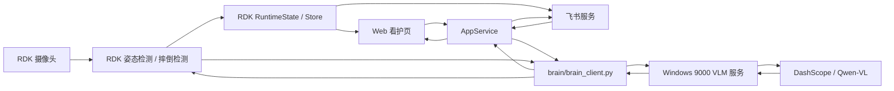

# ZhiShao RDK X5 架构说明

本文记录当前 Codex 工作区中 RDK 主程序与 Windows VLM 服务的分工和数据流。

## 组件边界

```text
rdk_app/
```

RDK 主程序运行在 RDK X5 上，负责边缘侧感知、控制和用户交互：

- 摄像头采集：读取本地摄像头画面。
- 姿态检测：使用 RDK 侧 YOLO pose 模型进行人体关键点检测。
- 摔倒检测：基于姿态、时间窗口和状态机判断疑似风险。
- 云台控制：通过串口控制云台方向。
- Web 看护页：提供本地看护页面和状态查看。
- 飞书交互：接收用户命令、回复状态、推送告警和日报。
- 大脑客户端：通过 `brain/brain_client.py` 调用 Windows VLM 服务。

```text
windows_brain/vlm_service_cascade.py
```

Windows VLM 服务运行在 Windows PC 上，负责调用 DashScope / Qwen-VL：

- 接收 RDK 发送的问题、图片或日志。
- 调用 DashScope / Qwen-VL。
- 将结构化分析结果返回给 RDK。

## 数据流



## 典型调用链

### 用户问答

```text
飞书或 Web 用户问题
-> RDK AppService
-> brain_client.py 调用 Windows /ask
-> Windows VLM 服务调用 DashScope / Qwen-VL
-> 返回 answer 和 need_image
-> RDK 回复飞书或 Web
```

### 疑似摔倒复核

```text
RDK 姿态检测发现疑似风险
-> 保存或传递现场图片
-> brain_client.py 调用 Windows /analyze
-> Windows VLM 服务调用 DashScope / Qwen-VL 复核场景
-> 返回 location、risk_level、description
-> RDK 决定是否告警
```

### 隐私复核

```text
用户请求临时查看真实画面
-> RDK 获取当前帧
-> brain_client.py 调用 Windows /privacy_check
-> Windows VLM 服务判断是否适合短时开放
-> 返回 safe_to_show、risk_level、reason
-> RDK 根据保护策略开放或拒绝真实画面
```

### 日报总结

```text
RDK 汇总活动日志
-> brain_client.py 调用 Windows /summarize
-> Windows VLM 服务生成简短总结
-> RDK 通过飞书或 Web 展示日报
```

## 部署边界

- RDK 正式项目目录：`/home/sunrise/ZhiShao_V2`
- RDK Codex 测试目录：`/home/sunrise/ZhiShao_V2_codex_test`
- 当前 Windows Codex 工作区：`E:\GitHub\ZhiShao`
- RDK 开发区：`rdk_app/`
- Windows VLM 服务开发区：`windows_brain/vlm_service_cascade.py`

后续同步到 RDK 时，默认先同步到测试目录，不覆盖正式目录。
